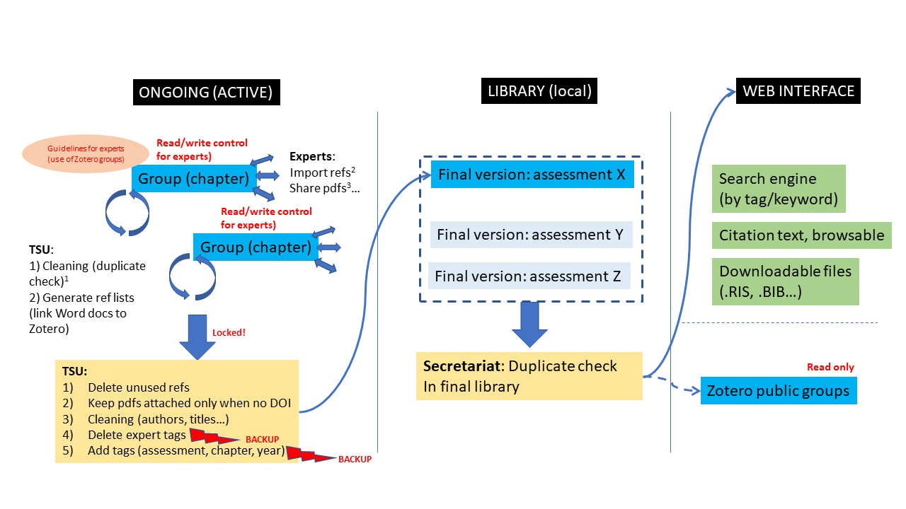

# Zotero

## Introduction

Zotero is, at the most basic level, a reference manager. It is designed to store, manage, and cite bibliographic references, such as books and articles. In Zotero, each of these references constitutes an item. More broadly, Zotero is a powerful tool for collecting and organizing research information and sources.

## Getting started

### How do I install Zotero

[https://www.zotero.org/support/quick\_start\_guide\#how\_do\_i\_install\_zotero](https://www.zotero.org/support/quick_start_guide#how_do_i_install_zotero)

### How do I open Zotero

[https://www.zotero.org/support/quick\_start\_guide\#how\_do\_i\_open\_zotero](https://www.zotero.org/support/quick_start_guide#how_do_i_open_zotero)

Zotero can be opened from your operating system's dock or file manager like any other program

### How do I join a group in Zotero

During the development of an assessment, private groups will be created at the assessment or chapter level depending on the needs of the assessment. Private groups means that only experts who are invited to the group will be able to see the group’s page. The private groups are completely hidden from group searches. They are not shown on members’ public profile pages and will not appear in search engine results. File sharing will be made available to allow group members to access and share files in addition to references. Invitations to the groups are managed by the assessment technical support unit.

## Adding bibliography to library

### Add item by identifier \(recommended method\)

Zotero can[ add items automatically](https://www.zotero.org/support/getting_stuff_into_your_library#add_item_by_identifier) using their an ISBN number, Digital Object Identifier \(DOI\), or PubMed ID. This is done by clicking the Add Item by Identifier button \(\) in the Zotero toolbar, typing in the ID number, and clicking OK. You can even paste or enter \(press Shift+Enter for a larger box\) a list of such identifiers at once

### Add item manually

Items can be[ added manually](https://www.zotero.org/support/getting_stuff_into_your_library#manually_adding_and_editing_items) by clicking the green New Item \(\) button in the Zotero toolbar, then selecting the appropriate item type. Metadata can then be added by hand in the right-hand pane. Apart from the versatility this provides, it is important for adding primary documents.

## Citing

Zotero uses Citation Style Language \(CSL\) to properly format citations in many different bibliographic [styles](https://www.zotero.org/styles). IPBES has adopted a style which can be downloaded here. To use this style

1. Download the style here: [https://gist.github.com/ipbes/e0cbd8aacb25bf1fb2153e04daba0327/archive/371ca8ec849a578469df03e4b920c14d62a0d5f9.zip](https://gist.github.com/ipbes/e0cbd8aacb25bf1fb2153e04daba0327/archive/371ca8ec849a578469df03e4b920c14d62a0d5f9.zip)
2. Unzip the package
3. In the[ Zotero Style Manager](https://www.zotero.org/support/preferences/cite), click the '+' button, then find the “IPBES citation style.csl” style file on your computer. 

## Reporting style errors

If the IPBES citation style.csl style doesn’t give the expected output, first make sure that you are running the latest \(stable\) version of Zotero, and have the most recent version of the style installed from the [IPBES Bibliography Style Repository](https://gist.github.com/ipbes/e0cbd8aacb25bf1fb2153e04daba0327/archive/371ca8ec849a578469df03e4b920c14d62a0d5f9.zip). Once you have made sure that the style deviates from the style guide, instructions for authors, or published examples, report the error by raising a ticket

## Reference workflow

1. The technical support units will be required to clean references stored in Zotero periodically. Experts will only have read only access when this is taking place
2. Experts are strongly encouraged to import references into Zotero using the Zotero web tool or by importing .ris and .bib files. Dragging of PDF files is discourgaged
3. File sharing through Zotero is possible. Preference should be on grey literature. DOI of other files will suffice.

## Contact

Please contact the assessment technical support unit if you have questions regarding getting files into the assessment/chapter library, organizing the assessment/chapter Library and taking notes, generating bibliographies,citations, and reports.

