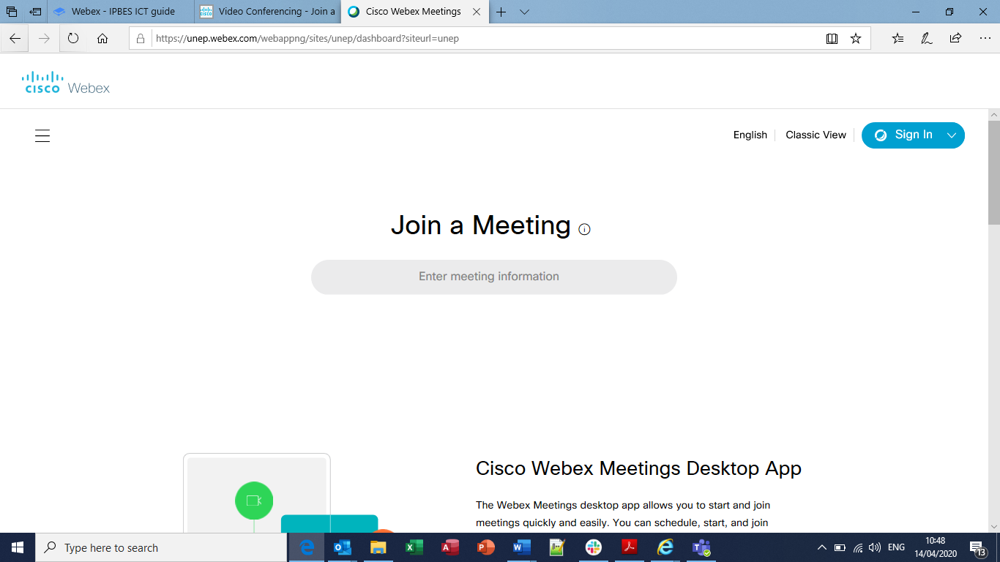
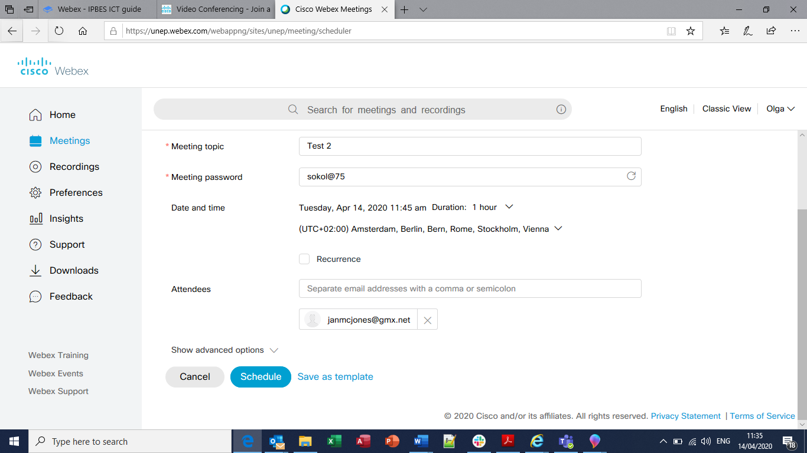

# Webex

## Introduction

Webex is the leading enterprise solution for video conferencing, online meetings, screen share and webinars. You can [join a test meeting](https://www.webex.com/test-meeting.html/) to familiarize yourself with webex.


Prerequisites:

1. Computer/laptop with Internet access.
2. Separate phone line.
3.  Webex meeting center conveniently works inside your **web browser** with no programme to download, install or configure.
4. You can also join the meeting from the **desktop app** or the **mobile app** if it is more convenient to you. More detailed information on this can be found [here](https://help.webex.com/en-us/ozygebb/Join-a-Cisco-Webex-Meeting)  


## Join a Webex Meeting from an Email Invitation 

* You will be sent an email with meeting information such as: meeting number \(access code\), date, time, and who initiated the meeting. If the meeting has a required password, it will be included in this mail;
* Click &lt;**Join meeting**&gt; in the body of the email.


1. You can join the meeting in different ways, like from your computer, mobile device, phone or video system. Your invite includes the options available to you for that particular meeting.   
2. If you choose to join the conference using a phone, you will need to call into the meeting. Dial the number provided in the mail and then use the access code and Attendee ID to connect when prompted.
3. If you choose to use your computer for audio, click &lt;**Call using computer&gt;**. You will have the opportunity to test your microphone and headset/speakers before connecting to the conference.


 

## Navigating Webex

When you are connected, you will see the following window. Some of the controls and options are available only to the presenter.

 

## Participating in a Webex meeting

**Private chat with the host or presenter:**

1. Under the Chat Window, click the drop-down box. Here you can select who can view your message;

2. Click on the name of the person you would like to privately chat with;

3. Type your message and press send.

_Private chats are displayed in the same box as public chats, but only those involved with the private chat will see your message._ 

### Raising your hand Using chat

You can raise your hand by first clicking on &lt;Participants&gt; button at the bottom of the window and then on a small hand icon next to your name in the participants list.  

### Disabling video

You can disable/enable video by clicking on the Camera icon

### Disabling microphone

You can mute/unmute you by clicking on microphone icon

### Sharing content

You can also share the content by clicking on the following icon

## Tips for managers/hosts

Sign in here  [https://unep.webex.com](https://unep.webex.com) using your unite identity account

If you want to schedule a meeting, please select &lt;Meetings&gt; in the menu on the left side 

After going to &lt;Meetings&gt; click on &lt;Schedule&gt; on the right side

Complete all the necessary fields and click on &lt;Schedule&gt; at the bottom of the form. You will receive confirmation per mail that the meeting has been scheduled.


1. You can start the meeting either from the email you have received or signing in your webex account and selecting the scheduled meeting under &lt;Meetings&gt;.
2. When scheduling a meeting you can also save it as template.
3. You can also make notes during the meeting selecting &lt;Notes&gt; under &lt;More Options&gt; icon.
4. You can also use a poll to create and share questionnaires. More detailed information can be found [here ](https://help.webex.com/en-us/n0pdj9x/Start-a-Poll-in-Cisco-Webex-Meetings) 
5. Breakout sessions can be used to place your attendees into smaller groups. Detailed information on this can be found [here](https://help.webex.com/en-us/8cckd2/Manage-Breakout-Sessions-in-Cisco-Webex-Training)
6. The order in which the attendees click on the Raise hand icon appears when you are a presenter. 


